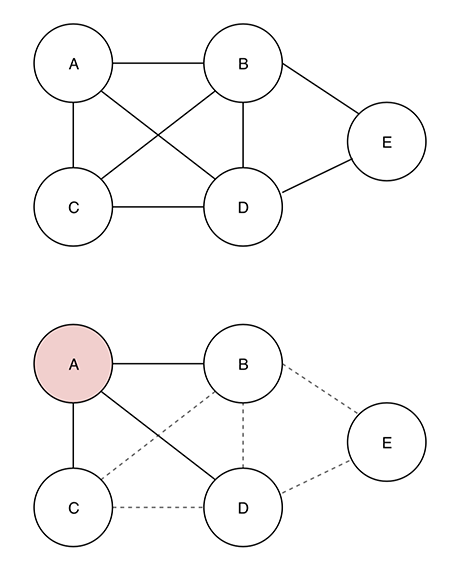
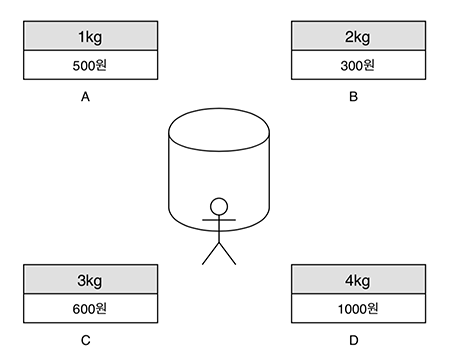

# Greedy Algorithm

### Greedy?

선택할 수 있는 대안이 여러 개 있을 때, 어떤 대안을 선택할지를 결정해야 한다. 이 때, 그리디(greedy) 알고리즘은 욕심을 부려 선택하기 때문에 붙여진 이름. 전체적인 상황을 고려하지 않고 당장 눈 앞에 닥친 상황만 보고 결정을 내린다.




그리기 알고리즘은 노드A의 관점에서난 최선의 선택을 하게 된다. A와 직접적으로 연결된 B, C, D와의 연결 정보만 고려하고, B-C, B-D 등 다른 노드들 사이의 관계는 고려하지 않는다. 즉, 그리디 알고리즘은 단계마다 그 순간에 판단할 수 있는 근거들만으로 최적의 선택을 한다.
또한 한 번 선택한 답은 이후에 변경하지 않는다. 즉, 나중에 선택한 답이 이전에 선택한 답에 영향을 주지 않는다. 노드B에서 선택한 결과가 이미 결정을 내린 노드A의 결과에 영향을 미치지 않는다.

그리디 알고리즘이 만드는 해답은 각 단계에서 결정한 선택들을 모은 것이다. 최적해(Optimal Solution)를 찾으려 하지 않고, 적당히 괜찮은 답을 찾는다. 적당히 괜찮은 답을 찾으려다 최적해가 나올 수도 있다. 최적해는 보장되지 않지만, 계산이 단순하고 시간이 적게 걸린다는 장점이 있다. 따라서 최적해를 구하기가 매우 어려운 문제라면 오히려 그리디 알고리즘을 사용하는 게 비교적 괜찮은 해를 적당히 빠른 시간에 얻을 수 있다.

### Concept

1. Selection function: 현재 단계에서 최선의 후보(가장 우수하다고 예상되는 해답)를 선택
2. Feasibility function: 선택된 후보가 답이 될 수 있는지 제약 사항 점검
3. Solution function: 지금까지 선택으로 문제의 답(solution)이 만들어졌는지 확인. 답이 만들어졌다면 알고리즘 종료


### Pseudocode
```
GreedyAlgorithm(Input){
    for(each e in Input){
        s = SelectionFunction(e)
        if( FeasibilityFunction(s) ){
            Solution <- s
            if( SolutionFunction(Solution){
                return Solution;
            }
        }
    }
    return Solution;
}
```


## (Fractional) Knapsack problem



배낭에 넣을 수 있는 최대 무게는 5kg이다. A와 B를 먼저 선택하면 3kg를 넣고 2kg가 남는다. 아직 배낭에 2kg만큼 더 넣을 수 있다. 그러나 C와 D는 각각 3kg, 4kg라서 둘 다 배낭에 담을 수 없다. 이 때, 물건을 쪼개서 일부만 담는다면? 3kg인 C를 2/3만큼 쪼개면 2kg가 되어 담을 수 있게 된다. 단, 물건을 쪼갰기 때문에 물건의 가치도 해당 비율만큼 쪼개진다. 따라서 C의 가격인 600원을 2/3만큼 쪼갠 400원이 배낭에 포함된다. Fractional Knapsack이라는 이름이 붙은 이유도, 이처럼 물건을 쪼갤 수 있는 경우에 배낭의 가치가 최대가 되도록 물건을 선택하는 문제이기 때문이다. 
그러면 어떤 기준으로 물건을 선택해야 할까? 배낭에 담을 수 있는 무게는 정해져있기 때문에 단순히 비싼 물건을 고를 수도 없고, 배낭에 담을 물건의 가격이 가장 높아야하기 때문에 단순히 무게가 무거운 물건을 골라서도 안 된다. 결론적으로 무게당 가격이 가장 비싼 물건을 계산해서 골라야 한다. 즉, (가격/무게)의 값이 가장 큰 물건부터 담아야 한다. 이를 기준으로 담을 수 있는 만큼 최대한 담으면 된다.

1. (가격/무게)가 큰 물건부터 선택
2. 선택한 물건을 최대한으로 담기

```
GreedyAlgorithm_FractionalKnapsack(capacity, items){
    Sort_items(items)
    for(each e in items){
        s = SelectionFunction(e)
        Solution <- s
        if(SolutionFunction(Solution){
            return Solution;
        }
    }
    return Solution;
}
```
Fractional knapsack의 경우 (가격/무게) 비율이 큰 순서대로 먼저 정렬한다는 게 가장 중요하다.
