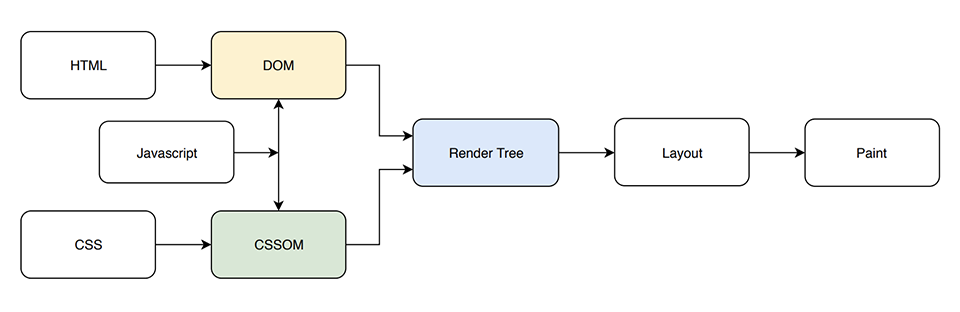

### 브라우저에서 페이지가 렌더링되는 과정

   

1. http코드가 서버로부터 전달이 되면, 브라우저는 청크 단위로 읽어서 파싱한다. 
2. 이를 바탕으로 DOM을 생성한다.
3. 외부 리소스(stylesheet, script)가 있으면 요청을 하고 다운을 받는다. 외부 자원 로딩시 병렬로 받아온다.
4. CSS는 CSS Object Model(CSSOM)을 만든다.
5. DOM 트리와 CSSOM 트리의 각 노드가 결합되어 렌더링에 필요한 정보로 활용된다. Javascript에서 CSS를 처리하거나 DOM을 핸들링하는 코드가 있으면 추가하여 렌더 트리를 만든다. 렌더 트리는 실제로 도큐먼트에 디스플레이되는 노드들로 구성된다.
    * Dom 트리 - 렌더 트리가 1:1로 매칭되지 않는다. `<head>`의 경우 노드이지만 렌더링되는 노드는 아니기 때문.
    * `display: "none"` 이 선언된 경우 렌더 트리에 나타나지 않는다. 그러나 `visibility: "hidden"` 으로 선언된 요소는 트리에 나타난다.

현재 디스플레이되는 요소들로 렌더 트리를 만든 후, 렌더 트리에서 CSS나 Javascript에서 변경할 수 있는 요소(크기, 위치 등)를 가지고 실제 요소의 레이아웃을 만드는 과정을 거친다. 이후에 최종적으로 Paint 단계를 거쳐서 사용자에게 보여주는 과정이 이루어진다.
