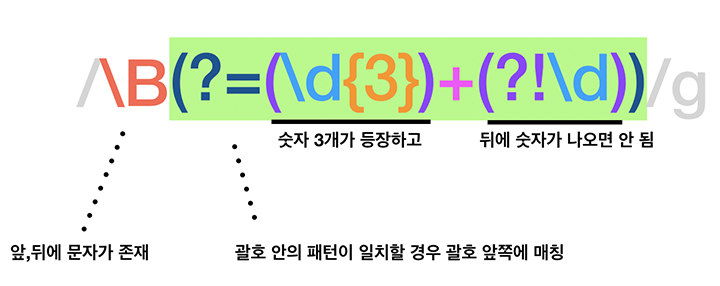

# 숫자에 1000단위로 콤마 표시하기

## 문제

요청수에 가독성을 높이기 위해 3자리 마다 콤마(,)를 표시하기

## 해결

정규식을 사용하여 표시한다. 슬래쉬(`/`)로 감싸는 정규식 리터럴을 사용하였다.

### 정규식 패턴 작성하기



1. `\B`: 구분자(,)를 삽입할 부분의 앞쪽에는 무조건 문자가 있어야 한다.

2. `x(?=y)`: y가 일치하는 x에만 대응된다.

3. `(\d{3})+(?!\d)`

   * `(\d{3})`: 숫자가 3번 나타나는 부분에 대응하는 것을 기억하라는 의미이다.
     * `(x)`: ( )에 해당하는 글자들을 그룹화하고 기억한다. ( )안의 문자들을 메모리에 할당할 수도 있다.
     * `\d`: 숫자에 해당되는 부분. `[0-9]`와 같다
     * `{n}`: 앞 표현식이 n번 나타나는 부분. `x\d{3}`은 x 뒤에 숫자가 3개 있다는 의미.

   * `+`: 앞 표현식이 1회 이상 반복되는 부분과 대응된다.
   * `x(?!y)`: x 뒤에 y가 없는 경우에만 x에 일치한다.
     *  `x(?!\d)`는 x 뒤에 더 이상 숫자가 없는 경우를 의미한다.
   * 즉, `(\d{3})+(?!\d)`는 숫자가 3번만 나타나는 부분을 의미한다.


자바스크립트 함수로 옮기면 다음과 같다.

```javascript
function numberWithCommas(x) {
    return x.toString().replace(/\B(?=(\d{3})+(?!\d))/g, ",")
}
```

문자열 안에서 3자리 숫자가 연속으로 등장하는 지점을 찾아 ,로 대체한다.

패턴에 대한 자세한 설명은 [Wikipedia Regular Expression](https://en.wikipedia.org/wiki/Regular_expression), [MDN 정규식](https://developer.mozilla.org/en-US/docs/Web/JavaScript/Guide/Regular_Expressions) 참고.


### 정규식을 사용하지 않는다면?

* Number 메서드인 [toLocalString()](https://developer.mozilla.org/en-US/docs/Web/JavaScript/Reference/Global_Objects/Number/toLocaleString)을 사용한다.